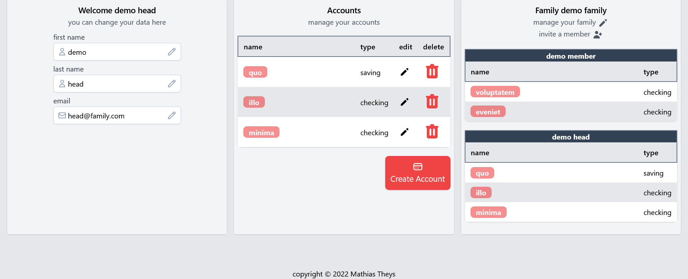
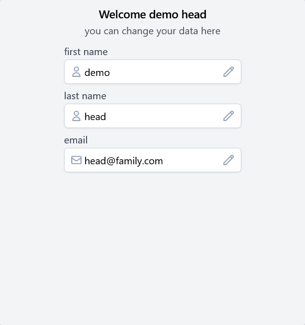
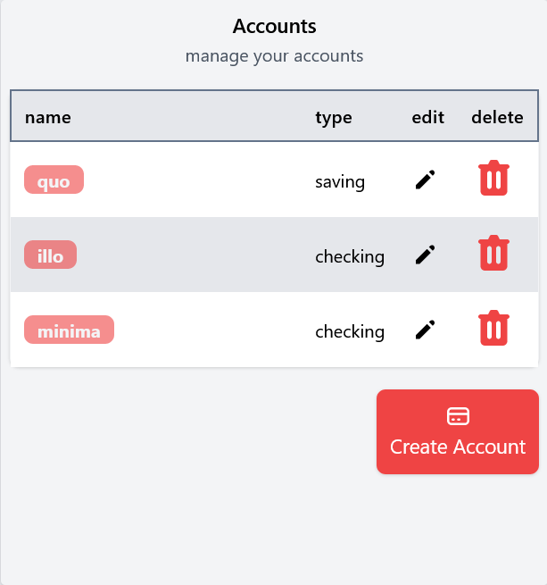
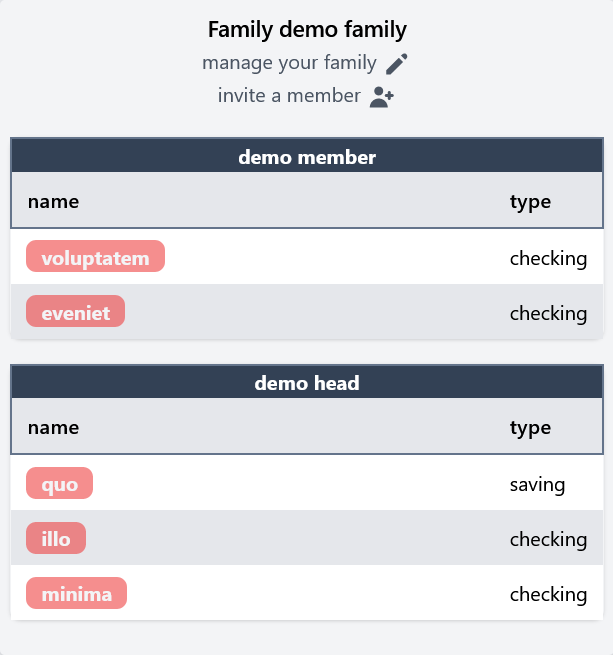

# My first laravel project

In my first project I have made simple website from scratch.
before I started I did some research by looking at starter-kits
like [Laravel Breeze](https://laravel.com/docs/9.x/starter-kits#laravel-breeze) & plugins
like [filament](https://filamentphp.com/).
But decided to **start without plugins**, in order to get a good foundation first.

## summary (more details below):

At the start of this project, I learned [Tailwindcss](https://tailwindcss.com/) for the styling since a lot of the
starter-kits and plugins use it. which I plan to use in following projects.
Along the way I added [AlpineJS](https://alpinejs.dev/) for functionality with a dark mode and dropdown in mobile.

After the general layout, navigation & a few pages (responsive and with a dark mode), I made an authentication system
with email verification.
Expanded on that with rate limiting emails, login & registration attempts, using both route limiters and custom-made
limiters in the controllers. (here I hit my first bigger problem more details below).

## What I used

- [Laravel](https://laravel.com/)
- [Tailwindcss](https://tailwindcss.com/)
- [AlpineJS](https://alpinejs.dev/)
- [vscode](https://code.visualstudio.com/)
- [phpstorm](https://www.jetbrains.com/phpstorm/)
- [github](https://github.com/AtlasMountains)
- [mailtrap](https://mailtrap.io/)
- [laravel-debugbar](https://github.com/barryvdh/laravel-debugbar)
- [Livewire](https://laravel-livewire.com/)
- [Sortable](https://github.com/livewire/sortable)
- [WireUI](https://livewire-wireui.com/)
- [Livewire-Powergrid](https://livewire-powergrid.com/#/)

## What I knew before

Before this project I already knew

1. [x] HTML, CSS, Sass, bootstrap,
2. [x] Javascript, PHP, MVC structure, twig templating
3. [x] Agile/SCRUM, Git, Git flow & [github](https://github.com/AtlasMountains).

Find out more at [My Portfolio](https://github.com/AtlasMountains).

## What I learned

### I started with the general layout, navigation & a few pages

In the beginning there was nothing, so something had to be made. And that something was the general layout and
navigation as well as some pages.
At the start I learned about routing (naming, grouping) and with routing comes views and there is a lot to cover with
views.

- blade templating
- work modular with @section @yield @include
- after the basics I learned how to work with custom components using `<x-component>` syntax
- style it using [Tailwindcss](https://tailwindcss.com/) some features like:

  - dark mode
  - mobile responsive
  - tailwindcss.config to change default behaviors or add custom colors, include plugins etc
  - tailwind components to group some classes together

- [AlpineJS](https://alpinejs.dev/) for dropdown & remembering dark mode in LocalStorage

### Second I made an authentication system.

After having played with the starter kit breeze, I wanted to build it from the beginning to learn how it all worked.
It was great to learn the basics of laravel and the system could always be expanded with more complex features.
After lots of work on the routing and views it was time to learn controllers, form requests, custom middleware, rate
limiting & job queuing.

I build an authentication system where you can register, login, verify email address, tested locally
using [Mailtrap](https://mailtrap.io/)

- view
  - login & registration page with server validation
  - showing validation errors in forms with @error
  - displaying custom error pages like 404
  - display session messages
- routing
  - used standard middleware like (auth, verified, guest)

#### Expanding to the authentication system and the first big problem

After I had the basic authentication system with email verification, I wanted to limit the amount of emails sent to
protect against spammers. And while we're at it, I also limited the amount of login and registration attempts both per
ip
address and in total to increase security.

This is where I hit my first big problem, there are two types of rate limiters, the naming is the same and syntax is
very similar, but they're different and obviously easily confused. It took me a while to figure that out. you can
use [rate limiters in routes](https://laravel.com/docs/9.x/routing#rate-limiting) which will automatically increment
upon visiting that route, but are different
from [rate limiters you can make yourself](https://laravel.com/docs/9.x/rate-limiting) in controllers and interact with
manually. At a point i was using two different types of limiters to limit the same action thinking I was interaction
with one and the same limiter, not knowing they were different. The documentation on that can be improved!

- rate limiting
  - Limit the amount of verification emails per user
  - Limit login and registration attempts:
    - per ip address using custom rate limiters in the controllers
    - in total using rate limiters in the routes as middleware
  - show info about the remaining emails & attempts and wait time
- middleware
  - made my own middleware to redirect if the user is already verified

After this I installed [laravel-debugbar](https://github.com/barryvdh/laravel-debugbar), cleaned-up & refactored some
code and updated composer.

### Dashboard

After the authentication system I made a user dashboard where users can edit there account information, manage there
accounts and join or manage a family.
In this dashboard I made use of a combination between Server Site Rendered SSR pages and dynamic components that would
update live via ajax requests using [Livewire](https://laravel-livewire.com/).

With livewire there was a lot to learn:

- Component class and view
- Props to give to components, and merging properties like classes
- lifecycle hooks like updated
- events and listeners to communicate between multiple components
- integration with [AlpineJS](https://alpinejs.dev/) for TALL stack
- synchronization between JS on client and variables on the server, if one updates so does the other
- notifications like messages, dialogs and models using [WireUI](https://livewire-wireui.com/)

#### Profile

In the profile section of the dashboard you can change your account information like first- & last name and email. upon
change, you get a notification or a confirmation dialog this was made using [Livewire](https://laravel-livewire.com/)
& [WireUI](https://livewire-wireui.com/). And is therefor a dynamic livewire component using ajax request to change the
information on the fly without reloading the page.

- real time validation of input
- lazy model to reduce AJAX request after each keystroke

#### Accounts

In the accounts section you can manage your accounts, this is also a dynamic livewire component using ajax, You can even
[drag and sort](https://github.com/livewire/sortable) the accounts to be in the order you want.

- Modifying migrations and table for sortable field
- updating the order on creating, deleting and obviously order change

#### Family

Users can make or join a family where you can choose which of your accounts will be visible to all family members,
members can only leave and edit their own accounts, but the head of a family can also invite and kick members & change
the family head.
If a user has ordered there account by drag and sort the order will be respected in the family section.

- More complex relations many to many
- Eager loading to prevent n+1 queries

## Accounts and Transactions

Let's dig deeper into accounts. When you open an account you can see 3 big sections.
The first is the charts area where you can see information clearly. This was made
using [Chart JS](https://www.chartjs.org/).
The calculations and formatting of the data was handled in separate Business/Service Classes.

The second section allows you to add transaction to your account, instead of using a standard form on Server Side
Rendered page, I opted to go fully livewire to make use of ajax to update the list of options in the form.
For example, if you enter a negative amount you cant select deposit type (the option will be removed from the list).
Because of course you cant deposit negative amounts into your account.

And the last section is an interactive table made using [Livewire-Powergrid](https://livewire-powergrid.com/#/).
That allows you to:

- sort
- filter
- search based on a combination of user defined criteria
- hide specific columns
- export to csv, excel
- delete and bulk delete

## Deploying

To deploy the site I made use of FTP, SSH, autogit a feature to automatically deploy if an update is pushed to GitHub.
I also set debug mode off, protected files form public view, etc.
To finish off I made a DemoSeeder to easily restore the demo users without affecting users' data.

- FTP
- SSH

### Changelog after first deployment

After working out the details of deploying I:

v1.0.1

- Bugfix: adding new tags

v1.1

- Updated this readme
- Ability to show/hide charts.
- The form to make a new transaction is more responsive (big improvement on small screen).

v1.2

- Implementing queuing for better user experience

v1.2.1

- Set up schedule seed demo accounts daily & workers to handel the queue
- Set up cronjob to run the schedule

v1.3

- Setup unit tests using pest
  - routing
  - calc account balance

v1.3.1

- Run tests automaticaly using github actions

v1.4

- Remove stripes on exports

v1.5

- Updated readme

## Where to go from here

- ~~implement test for stability v1.3~~
- quality of life features to improve charts
  - ~~Ability to show/hide charts v1.1~~
  - choose which years data is used
